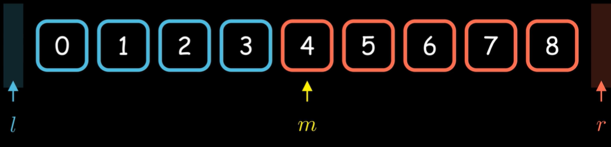
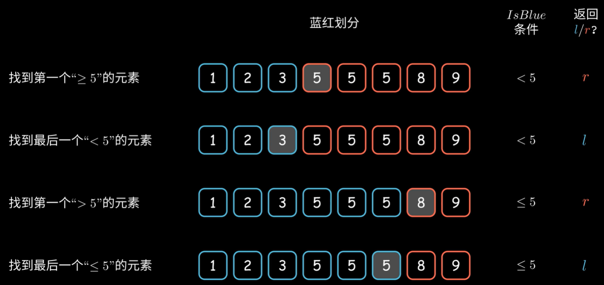

# 二分查找

## 一般流程

```
l = -1, r = N
while l + 1 != r:
	m = ((r-l)>>1)+l  #就是mid = (l+r)/2
	if(IsBlue(m)) l = m
	else r = m
return l or r
```



### 关于返回值的选择

根据题目要求选择返回值



## 题

#### [35. 搜索插入位置](https://leetcode.cn/problems/search-insert-position/)

给定一个排序数组和一个目标值，在数组中找到目标值，并返回其索引。如果目标值不存在于数组中，返回它将会被按顺序插入的位置。

请必须使用时间复杂度为 `O(log n)` 的算法。

**示例 1:**

```
输入: nums = [1,3,5,6], target = 5
输出: 2
```

**示例 2:**

```
输入: nums = [1,3,5,6], target = 2
输出: 1
```

**示例 3:**

```
输入: nums = [1,3,5,6], target = 7
输出: 4
```

**提示:**

- `1 <= nums.length <= 104`
- `-104 <= nums[i] <= 104`
- `nums` 为 **无重复元素** 的 **升序** 排列数组
- `-104 <= target <= 104`

##### 代码

```java
public int searchInsert(int[] nums, int target) {
    int n = nums.length;
    int l = -1, r = n;
    while(l + 1 != r){
        int mid = ((r - l) >> 1) + l;
        if(nums[mid] < target)l = mid;
        else r = mid;
    }
    return r;
}
```

找到目标值，如果没有就返回目标值本应该在的位置，那么将蓝色区域设定为小于目标值的区域，得到的l就是小于目标值的最大值，r是>=目标值的最小值，则r就是所求位置。

#### [74. 搜索二维矩阵](https://leetcode.cn/problems/search-a-2d-matrix/)

给你一个满足下述两条属性的 `m x n` 整数矩阵：

- 每行中的整数从左到右按非严格递增顺序排列。
- 每行的第一个整数大于前一行的最后一个整数。

给你一个整数 `target` ，如果 `target` 在矩阵中，返回 `true` ；否则，返回 `false` 。

**示例 1：**


```
输入：matrix = [[1,3,5,7],[10,11,16,20],[23,30,34,60]], target = 3
输出：true
```

**示例 2：**


```
输入：matrix = [[1,3,5,7],[10,11,16,20],[23,30,34,60]], target = 13
输出：false
```

**提示：**

- `m == matrix.length`
- `n == matrix[i].length`
- `1 <= m, n <= 100`
- `-10^4 <= matrix[i][j], target <= 10^4`

##### 分析

- 先找所在行数，比较每行第一个数，小于等于目标值为蓝色，取l1即为所在行
- 在行里查找列，小于等于目标值为蓝色，取l2就应该是所在列
- 判断$matrix[l1][l2]$是不是目标值，如果不是则矩阵里没有目标值

##### 代码

```java
public boolean searchMatrix(int[][] matrix, int target) {
    int n = matrix.length;
    int l = -1, r = n;
    while(l + 1 != r){
        int mid = ((r - l) >> 1) + l;
        if(matrix[mid][0] <= target)l = mid;
        else r = mid;
    }
    if(l == -1)return false;
    int ll = -1, rr = matrix[l].length;
    while(ll + 1 != rr){
        int mid = ((rr - ll) >> 1) + ll;
        if(matrix[l][mid] <= target) ll = mid;
        else rr = mid;
    }
    return ll != -1 && matrix[l][ll] == target;
}
```

#### [33. 搜索旋转排序数组](https://leetcode.cn/problems/search-in-rotated-sorted-array/)

整数数组 `nums` 按升序排列，数组中的值 **互不相同** 。

在传递给函数之前，`nums` 在预先未知的某个下标 `k`（`0 <= k < nums.length`）上进行了 **旋转**，使数组变为 `[nums[k], nums[k+1], ..., nums[n-1], nums[0], nums[1], ..., nums[k-1]]`（下标 **从 0 开始** 计数）。例如， `[0,1,2,4,5,6,7]` 在下标 `3` 处经旋转后可能变为 `[4,5,6,7,0,1,2]` 。

给你 **旋转后** 的数组 `nums` 和一个整数 `target` ，如果 `nums` 中存在这个目标值 `target` ，则返回它的下标，否则返回 `-1` 。

你必须设计一个时间复杂度为 `O(log n)` 的算法解决此问题。

**示例 1：**

```
输入：nums = [4,5,6,7,0,1,2], target = 0
输出：4
```

**示例 2：**

```
输入：nums = [4,5,6,7,0,1,2], target = 3
输出：-1
```

**示例 3：**

```
输入：nums = [1], target = 0
输出：-1 
```

**提示：**

- `1 <= nums.length <= 5000`
- `-104 <= nums[i] <= 104`
- `nums` 中的每个值都 **独一无二**
- 题目数据保证 `nums` 在预先未知的某个下标上进行了旋转
- `-104 <= target <= 104`

##### 分析

- 先求得旋转了几次，也就是找到第一个小于nums[0]的位置，蓝色为>=nums[0]，取r为原来的nums[0]
- 根据上面求到的位置修正偏移再查找一次，<=目标值为蓝色，取l为目标值位置

##### 代码

```java
public int search(int[] nums, int target) {
    int n = nums.length;
    if(n == 0) return -1;
    int l = -1, r = n;
    while(l+1 != r){
        int mid = ((r - l) >> 1) + l;
        if(nums[mid] > nums[n-1])l = mid;
        else r = mid;
    }
    int trueStart = r;
    l = -1; r = n;
    while(l + 1 != r){
        int mid = ((r - l) >> 1) + l;
        if(nums[(mid+trueStart)%n] <= target)l = mid;
        else r = mid;
    }
    if(l!=-1 && nums[(l+trueStart)%n] == target)return (l+trueStart)%n;
    else return -1;
}
```

#### [4. 寻找两个正序数组的中位数](https://leetcode.cn/problems/median-of-two-sorted-arrays/)

给定两个大小分别为 `m` 和 `n` 的正序（从小到大）数组 `nums1` 和 `nums2`。请你找出并返回这两个正序数组的 **中位数** 。

算法的时间复杂度应该为 `O(log (m+n))` 。

**示例 1：**

```
输入：nums1 = [1,3], nums2 = [2]
输出：2.00000
解释：合并数组 = [1,2,3] ，中位数 2
```

**示例 2：**

```
输入：nums1 = [1,2], nums2 = [3,4]
输出：2.50000
解释：合并数组 = [1,2,3,4] ，中位数 (2 + 3) / 2 = 2.5
```

**提示：**

- `nums1.length == m`
- `nums2.length == n`
- `0 <= m <= 1000`
- `0 <= n <= 1000`
- `1 <= m + n <= 2000`
- `-106 <= nums1[i], nums2[i] <= 106`

##### 分析

- 这里主要是用了类似于二分的思想，查找第k小的数，每个数组都拿出第k/2 个数比较，较小的那个数左边的所有数都可以不再考虑，因为比它小的数最多只有k-2个，必然不可能是第k个数。
- left=(n+m+1)/2，right=(n+m+2)/2，如果n+m是偶数，那么就分别是最中间的两个数，如果是奇数就会是一个数，就不需要分类讨论什么了
- 如果某个数组没有k/2那么长，就取最后一个元素
- 把长度较小的放在nums1，就不用讨论长度问题了

##### 代码

```java
public double findMedianSortedArrays(int[] nums1, int[] nums2) {
        int n = nums1.length;
        int m = nums2.length;
        int left = (n + m + 1) / 2;
        int right = (n + m + 2) / 2;
        return (getKth(nums1, 0, n-1, nums2, 0, m-1, left) + getKth(nums1, 0, n-1, nums2, 0, m-1, right)) * 0.5;
    }

    private int getKth(int[] nums1, int start1, int end1, int[] nums2, int start2, int end2, int k){
        int len1 = end1 - start1 + 1;
        int len2 = end2 - start2 + 1;
        if(len1 > len2) return getKth(nums2, start2, end2, nums1, start1, end1, k);
        if(len1 == 0)return nums2[start2 + k-1];

        if(k == 1) return Math.min(nums1[start1], nums2[start2]);

        int i = start1 + Math.min(len1, k/2) - 1;
        int j = start2 + Math.min(len2, k/2) - 1;

        if(nums1[i] > nums2[j]){
            return getKth(nums1, start1, end1, nums2, j + 1, end2, k-(j-start2 + 1));
        }
        else {
            return getKth(nums1, i + 1, end1, nums2, start2, end2, k - (i - start1 + 1));
        }
    }
```

