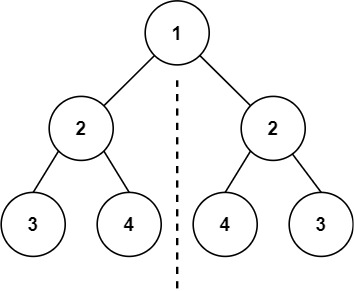
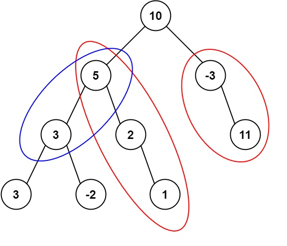

# 二叉树

- 满二叉树：所有节点的子节点要么是2个要么0个
- 完全二叉树：节点从上到下从左到右连续
- 二叉搜索树：左子树的所有节点都小于根节点，右子树的所有节点都大于根节点
- 平衡二叉搜索树：左子树和右子树高度的绝对值不大于1

## 二叉树遍历

### 递归方式

#### 递归三部曲

- 确定递归函数的参数和返回值
- 确定终止条件
- 确定单层递归的逻辑

#### [二叉树的中序遍历](https://leetcode.cn/problems/binary-tree-inorder-traversal/)

给定一个二叉树的根节点 `root` ，返回 *它的 **中序** 遍历* 。

**示例 1：**


```
输入：root = [1,null,2,3]
输出：[1,3,2]
```

**示例 2：**

```
输入：root = []
输出：[]
```

**示例 3：**

```
输入：root = [1]
输出：[1]
```

**提示：**

- 树中节点数目在范围 `[0, 100]` 内
- `-100 <= Node.val <= 100`

##### 代码

```java
public List<Integer> inorderTraversal(TreeNode root) {
    List<Integer> res = new ArrayList<Integer>();
    inorder(root, res);
    return res;
}

public void inorder(TreeNode root, List<Integer> res) {
    if (root == null) {
        return;
    }
    inorder(root.left, res);
    res.add(root.val);
    inorder(root.right, res);
}
```

#### 前序遍历

```java
public void preorder(TreeNode root, List<Integer> res){
    if(root == null)return;
    res.add(root.val);
    preorder(root.left, res);
    preorder(root.right, res);
}
```

#### 后序遍历

```java
public void afterorder(TreeNode root, List<Integer> res){
    if(root == null)return;
    afterorder(root.left, res);
    afterorder(root.right, res);
    res.add(root.val);
}
```

### 迭代遍历

迭代遍历与递归不同，不同顺序遍历就不能单纯调换顺序来实现了

#### 前序遍历

- 要先压入右节点再压入左节点，这样在弹出时才是先弹出左节点
- 访问节点压入栈，处理节点弹出栈

```java
public List<Integer> preorderTraversal(TreeNode root) {
    List<Integer> ret = new ArrayList<>();
    Stack<TreeNode> stack = new Stack<>();
    stack.push(root);
    while(!stack.isEmpty()){
        TreeNode node = stack.pop();
        if(node == null) continue;
        ret.add(node.val);
        stack.push(node.right);
        stack.push(node.left);
    }
    return ret;
}
```

#### 后序遍历

- 通过修改前序可以得到，前序是先压入右节点，再左节点，顺序是处理顺序是中左右，那么改变顺序，先压入左节点再压入右节点，处理顺序就是中右左，再将结果逆转，就是左右中了。

```java
public List<Integer> postorderTraversal(TreeNode root) {
    List<Integer> res = new ArrayList<>();
    Deque<TreeNode> stk = new LinkedList<>();
    stk.push(root);
    while(!stk.isEmpty()){
        TreeNode node = stk.pop();
        if(node == null)continue;
        res.add(node.val);
        stk.push(node.left);
        stk.push(node.right);
    }
    Collections.reverse(res);
    return res;
}
```

#### 中序遍历

- 与其他顺序不同的是，中序遍历的访问顺序和处理顺序并不相同，访问必然是从根节点开始的，但是处理要从最左节点开始
- 将左节点全部入栈，如果左节点为空了才弹出栈处理，此时才是最左节点，然后访问右节点

```java
public List<Integer> inorderTraversal(TreeNode root) {
    List<Integer> res = new ArrayList<>();
    Deque<TreeNode> stk = new LinkedList<TreeNode>();
    while(root != null || !stk.isEmpty()){
        while(root != null){
            stk.push(root);
            root = root.left;
        }
        root = stk.pop();
        res.add(root.val);
        root = root.right;
    }
    return res;
}
```

### 层序遍历

#### [102. 二叉树的层序遍历](https://leetcode.cn/problems/binary-tree-level-order-traversal/)

给你二叉树的根节点 `root` ，返回其节点值的 **层序遍历** 。 （即逐层地，从左到右访问所有节点）。

**示例 1：**


```
输入：root = [3,9,20,null,null,15,7]
输出：[[3],[9,20],[15,7]]
```

**示例 2：**

```
输入：root = [1]
输出：[[1]]
```

**示例 3：**

```
输入：root = []
输出：[]
```

**提示：**

- 树中节点数目在范围 `[0, 2000]` 内
- `-1000 <= Node.val <= 1000`

```java
public List<List<Integer>> levelOrder(TreeNode root) {
    Queue<TreeNode> queue = new LinkedList<>();
    List<List<Integer>> res = new ArrayList<>();
    if (root == null) {
        return res;
    }
    queue.offer(root);
    while(!queue.isEmpty()){
        List<Integer> level = new ArrayList<Integer>();
        int currentLevelSize = queue.size();
        for (int i = 1; i <= currentLevelSize; ++i) {
            TreeNode node = queue.poll();
            level.add(node.val);
            if (node.left != null) {
                queue.offer(node.left);
            }
            if (node.right != null) {
                queue.offer(node.right);
            }
        }
        res.add(level);
    }
    return res;
}
```

## 基本题

==关键是确定遍历顺序。==

#### [226. 翻转二叉树](https://leetcode.cn/problems/invert-binary-tree/)

给你一棵二叉树的根节点 `root` ，翻转这棵二叉树，并返回其根节点。

**示例 1：**


```
输入：root = [4,2,7,1,3,6,9]
输出：[4,7,2,9,6,3,1]
```

**示例 2：**


```
输入：root = [2,1,3]
输出：[2,3,1]
```

**示例 3：**

```
输入：root = []
输出：[]
```

**提示：**

- 树中节点数目范围在 `[0, 100]` 内
- `-100 <= Node.val <= 100`

##### 分析

- 确定递归参数和返回值，参数就是root，返回值TreeNode
- 终止条件，root为null，返回root
- 单层逻辑，可以用前中后序不同来处理，逻辑就是交换而已

后序

```java
public TreeNode invertTree(TreeNode root) {
    if(root == null)return null;
    TreeNode left = invertTree(root.left);
    TreeNode right = invertTree(root.right);
    root.left = right;
    root.right = left;
    return root;
}
```

前序

```java
public TreeNode invertTree(TreeNode root) {
    if(root == null)return null;
    TreeNode left = root.left;
    root.left = root.right;
    root.right = left;
    invertTree(root.left);
    invertTree(root.right);
    return root;
}
```

中序也行，但是两次都是去左节点，因为中途右节点到左节点去了

```java
public TreeNode invertTree(TreeNode root) {
    if(root == null)return null;
    invertTree(root.left);
    TreeNode left = root.left;
    root.left = root.right;
    root.right = left;
    invertTree(root.left);
    return root;
}
```

#### [104. 二叉树的最大深度](https://leetcode.cn/problems/maximum-depth-of-binary-tree/)

给定一个二叉树 `root` ，返回其最大深度。

二叉树的 **最大深度** 是指从根节点到最远叶子节点的最长路径上的节点数。

**示例 1：**


 

```
输入：root = [3,9,20,null,null,15,7]
输出：3
```

**示例 2：**

```
输入：root = [1,null,2]
输出：2
```

**提示：**

- 树中节点的数量在 `[0, 104]` 区间内。
- `-100 <= Node.val <= 100`

##### 分析

- 对于深度，是指某个节点到根节点的距离，高度是到叶节点的距离。
- 求深度一般前序遍历，高度一般后序遍历。
- 求最大深度就等于求根节点的高度

```java
public int maxDepth(TreeNode root) {
    if(root == null)return 0;
    return Math.max(maxDepth(root.left), maxDepth(root.right)) + 1;
}
```

这就是后序遍历得来的。很明显题目也没想让我写前序遍历来，前序就跟深搜差不多吧

```java
int depth = 0;
int max = 0;
public int maxDepth(TreeNode root) {
    if(root == null){
        max = Math.max(max, depth);
        return max;
    }
    depth++;
    maxDepth(root.left);
    maxDepth(root.right);
    depth--;
    return max;
}
```

#### [101. 对称二叉树](https://leetcode.cn/problems/symmetric-tree/)

给你一个二叉树的根节点 `root` ， 检查它是否轴对称。

**示例 1：**



```
输入：root = [1,2,2,3,4,4,3]
输出：true
```

**示例 2：**


```
输入：root = [1,2,2,null,3,null,3]
输出：false
```

**提示：**

- 树中节点数目在范围 `[1, 1000]` 内
- `-100 <= Node.val <= 100`
- 处理根节点时肯定需要已经处理了左右子节点了才能判断是否对称，否则直接处理根节点，那么只能判断根节点的左右节点，左右子树是否真的对称就不知道了，左右子树返回信息给根节点，就是要后序遍历。

```java
public boolean isSymmetric(TreeNode root) {
    if(root == null) return true;
    return isSymmetric(root.left, root.right);
}

private boolean isSymmetric(TreeNode r1, TreeNode r2){
    // 终止条件
    if(r1 == null && r2 == null)return true;
    if(r1 == null || r2 == null)return false;
    if(r1.val != r2.val)return false;
    // 后序遍历，因为是先去了左右节点，结果取与后才返回
    return isSymmetric(r1.left, r2.right) && isSymmetric(r1.right, r2.left);
}
```

#### [543. 二叉树的直径](https://leetcode.cn/problems/diameter-of-binary-tree/)

给你一棵二叉树的根节点，返回该树的 **直径** 。

二叉树的 **直径** 是指树中任意两个节点之间最长路径的 **长度** 。这条路径可能经过也可能不经过根节点 `root` 。

两节点之间路径的 **长度** 由它们之间边数表示。

**示例 1：**


```
输入：root = [1,2,3,4,5]
输出：3
解释：3 ，取路径 [4,2,1,3] 或 [5,2,1,3] 的长度。
```

**示例 2：**

```
输入：root = [1,2]
输出：1
```

**提示：**

- 树中节点数目在范围 `[1, 104]` 内
- `-100 <= Node.val <= 100`
- 计算每个节点的左右子节点的深度，加起来就是经过这个节点的最长路径，因为需要左右子节点的深度，所以后序遍历整个树，记录最大的值

```java
int max = 0;
public int diameterOfBinaryTree(TreeNode root) {
    maxDepth(root);
    return max;
}

public int maxDepth(TreeNode root){
    if(root == null)return 0;
    int left = maxDepth(root.left);
    int right = maxDepth(root.right);
    max = Math.max(max, left + right);
    return Math.max(left, right) + 1;
}
```

#### [199. 二叉树的右视图](https://leetcode.cn/problems/binary-tree-right-side-view/)

给定一个二叉树的 **根节点** `root`，想象自己站在它的右侧，按照从顶部到底部的顺序，返回从右侧所能看到的节点值。

**示例 1:**


```
输入: [1,2,3,null,5,null,4]
输出: [1,3,4]
```

**示例 2:**

```
输入: [1,null,3]
输出: [1,3]
```

**示例 3:**

```
输入: []
输出: []
```

**提示:**

- 二叉树的节点个数的范围是 `[0,100]`
- `-100 <= Node.val <= 100` 
- 层序遍历取每一层最右边的

```java
public List<Integer> rightSideView(TreeNode root) {
    List<Integer> res = new ArrayList<>();
    Queue<TreeNode> queue = new LinkedList<>();
    if(root == null)return res;
    queue.offer(root);
    while(!queue.isEmpty()){
        int levelSize = queue.size();
        for(int i = 0; i < levelSize; i++){
            TreeNode node = queue.poll();
            if(node.left!=null)queue.offer(node.left);
            if(node.right!=null)queue.offer(node.right);
            if(i == levelSize-1)res.add(node.val);
        }
    }
    return res;    
}
```

#### [114. 二叉树展开为链表](https://leetcode.cn/problems/flatten-binary-tree-to-linked-list/)

给你二叉树的根结点 `root` ，请你将它展开为一个单链表：

- 展开后的单链表应该同样使用 `TreeNode` ，其中 `right` 子指针指向链表中下一个结点，而左子指针始终为 `null` 。
- 展开后的单链表应该与二叉树 [**先序遍历**](https://baike.baidu.com/item/先序遍历/6442839?fr=aladdin) 顺序相同。

**示例 1：**


```
输入：root = [1,2,5,3,4,null,6]
输出：[1,null,2,null,3,null,4,null,5,null,6]
```

**示例 2：**

```
输入：root = []
输出：[]
```

**示例 3：**

```
输入：root = [0]
输出：[0]
```

**提示：**

- 树中结点数在范围 `[0, 2000]` 内
- `-100 <= Node.val <= 100`

##### 分析

- 按照正常的想法，先序遍历，然后把左子节点插到右子节点，但是这样会丢失右子节点
- 那么就反过来，按照先序的逆序遍历，即右左中，同时保存遍历的上一个节点，遍历下一个时就直接插到右节点，这样将左子节点就不用担心丢失右子节点了，因为已经遍历过了

```java
public void flatten(TreeNode root) {
    if(root == null)return;
    flatten(root.right);
    flatten(root.left);
    root.right = pre;
    root.left = null;
    pre = root;
}
```

#### [105. 从前序与中序遍历序列构造二叉树](https://leetcode.cn/problems/construct-binary-tree-from-preorder-and-inorder-traversal/)

给定两个整数数组 `preorder` 和 `inorder` ，其中 `preorder` 是二叉树的**先序遍历**， `inorder` 是同一棵树的**中序遍历**，请构造二叉树并返回其根节点。

**示例 1:**


```
输入: preorder = [3,9,20,15,7], inorder = [9,3,15,20,7]
输出: [3,9,20,null,null,15,7]
```

**示例 2:**

```
输入: preorder = [-1], inorder = [-1]
输出: [-1]
```

**提示:**

- `1 <= preorder.length <= 3000`
- `inorder.length == preorder.length`
- `-3000 <= preorder[i], inorder[i] <= 3000`
- `preorder` 和 `inorder` 均 **无重复** 元素
- `inorder` 均出现在 `preorder`
- `preorder` **保证** 为二叉树的前序遍历序列
- `inorder` **保证** 为二叉树的中序遍历序列

```java
private Map<Integer, Integer> indexMap;

public TreeNode myBuildTree(int[] preorder, int[] inorder, int preorder_left, int preorder_right, int inorder_left, int inorder_right) {
    if (preorder_left > preorder_right) {
        return null;
    }

    // 前序遍历中的第一个节点就是根节点
    int preorder_root = preorder_left;
    // 在中序遍历中定位根节点
    int inorder_root = indexMap.get(preorder[preorder_root]);

    // 先把根节点建立出来
    TreeNode root = new TreeNode(preorder[preorder_root]);
    // 得到左子树中的节点数目
    int size_left_subtree = inorder_root - inorder_left;
    // 递归地构造左子树，并连接到根节点
    // 先序遍历中「从 左边界+1 开始的 size_left_subtree」个元素就对应了中序遍历中「从 左边界 开始到 根节点定位-1」的元素
    root.left = myBuildTree(preorder, inorder, preorder_left + 1, preorder_left + size_left_subtree, inorder_left, inorder_root - 1);
    // 递归地构造右子树，并连接到根节点
    // 先序遍历中「从 左边界+1+左子树节点数目 开始到 右边界」的元素就对应了中序遍历中「从 根节点定位+1 到 右边界」的元素
    root.right = myBuildTree(preorder, inorder, preorder_left + size_left_subtree + 1, preorder_right, inorder_root + 1, inorder_right);
    return root;
}

public TreeNode buildTree(int[] preorder, int[] inorder) {
    int n = preorder.length;
    // 构造哈希映射，帮助我们快速定位根节点
    indexMap = new HashMap<Integer, Integer>();
    for (int i = 0; i < n; i++) {
        indexMap.put(inorder[i], i);
    }
    return myBuildTree(preorder, inorder, 0, n - 1, 0, n - 1);
}
```

得再参透参透才行

#### [437. 路径总和 III](https://leetcode.cn/problems/path-sum-iii/)

给定一个二叉树的根节点 `root` ，和一个整数 `targetSum` ，求该二叉树里节点值之和等于 `targetSum` 的 **路径** 的数目。

**路径** 不需要从根节点开始，也不需要在叶子节点结束，但是路径方向必须是向下的（只能从父节点到子节点）。

**示例 1：**



```
输入：root = [10,5,-3,3,2,null,11,3,-2,null,1], targetSum = 8
输出：3
解释：和等于 8 的路径有 3 条，如图所示。
```

**示例 2：**

```
输入：root = [5,4,8,11,null,13,4,7,2,null,null,5,1], targetSum = 22
输出：3
```

**提示:**

- 二叉树的节点个数的范围是 `[0,1000]`
- `-109 <= Node.val <= 109` 
- `-1000 <= targetSum <= 1000` 
- 深搜

```java
public int pathSum(TreeNode root, long targetSum) {
    if (root == null) {
        return 0;
    }

    int ret = rootSum(root, targetSum);
    ret += pathSum(root.left, targetSum);
    ret += pathSum(root.right, targetSum);
    return ret;
}

public int rootSum(TreeNode root, long targetSum) {
    int ret = 0;

    if (root == null) {
        return 0;
    }
    int val = root.val;
    if (val == targetSum) {
        ret++;
    } 

    ret += rootSum(root.left, targetSum - val);
    ret += rootSum(root.right, targetSum - val);
    return ret;
}
```

#### [236. 二叉树的最近公共祖先](https://leetcode.cn/problems/lowest-common-ancestor-of-a-binary-tree/)

给定一个二叉树, 找到该树中两个指定节点的最近公共祖先。

[百度百科](https://baike.baidu.com/item/最近公共祖先/8918834?fr=aladdin)中最近公共祖先的定义为：“对于有根树 T 的两个节点 p、q，最近公共祖先表示为一个节点 x，满足 x 是 p、q 的祖先且 x 的深度尽可能大（**一个节点也可以是它自己的祖先**）。”

**示例 1：**


```
输入：root = [3,5,1,6,2,0,8,null,null,7,4], p = 5, q = 1
输出：3
解释：节点 5 和节点 1 的最近公共祖先是节点 3 。
```

**示例 2：**


```
输入：root = [3,5,1,6,2,0,8,null,null,7,4], p = 5, q = 4
输出：5
解释：节点 5 和节点 4 的最近公共祖先是节点 5 。因为根据定义最近公共祖先节点可以为节点本身。
```

**示例 3：**

```
输入：root = [1,2], p = 1, q = 2
输出：1
```

**提示：**

- 树中节点数目在范围 `[2, 105]` 内。
- `-109 <= Node.val <= 109`
- 所有 `Node.val` `互不相同` 。
- `p != q`
- `p` 和 `q` 均存在于给定的二叉树中。

##### 分析

- 后序遍历，如果找到p或q就返回，所以如果一个节点是公共祖先，那么它的左右节点来的返回值应该都不是空的，然后将该节点一直往外返回就行了。

```java
public TreeNode lowestCommonAncestor(TreeNode root, TreeNode p, TreeNode q) {
    if(root == null || root == p || root == q)return root;
    TreeNode left = lowestCommonAncestor(root.left, p, q);
    TreeNode right = lowestCommonAncestor(root.right, p, q);
    if(left == null)return right;
    if(right == null)return left;
    return root;
}
```

#### [124. 二叉树中的最大路径和](https://leetcode.cn/problems/binary-tree-maximum-path-sum/)

二叉树中的 **路径** 被定义为一条节点序列，序列中每对相邻节点之间都存在一条边。同一个节点在一条路径序列中 **至多出现一次** 。该路径 **至少包含一个** 节点，且不一定经过根节点。

**路径和** 是路径中各节点值的总和。

给你一个二叉树的根节点 `root` ，返回其 **最大路径和** 。

**示例 1：**


```
输入：root = [1,2,3]
输出：6
解释：最优路径是 2 -> 1 -> 3 ，路径和为 2 + 1 + 3 = 6
```

**示例 2：**


```
输入：root = [-10,9,20,null,null,15,7]
输出：42
解释：最优路径是 15 -> 20 -> 7 ，路径和为 15 + 20 + 7 = 42
```

**提示：**

- 树中节点数目范围是 `[1, 3 * 104]`
- `-1000 <= Node.val <= 1000`

##### 分析

- 居然是我都想得出来的困难题，和最大直径那道题类似，只是后序遍历得到的是左右子树的最长路径，再用一个全局变量在遍历过程中记录最大值，要注意的是，记录的是左右最长路径和根节点的和，但是返回的值是左右其中一个最长的和根节点的和。

```java
int maxSum = Integer.MIN_VALUE;

public int maxPathSum(TreeNode root) {
    if(root == null)return 0;
    maxSum(root);
    return maxSum;
}

public int maxSum(TreeNode root){
    if(root == null)return 0;
    int left = Math.max(maxSum(root.left), 0);
    int right = Math.max(maxSum(root.right), 0);
    int maxx = root.val + left + right;
    maxSum = Math.max(maxx, maxSum);
    return root.val + Math.max(left, right);
}
```


## 二叉搜索树

#### [108. 将有序数组转换为二叉搜索树](https://leetcode.cn/problems/convert-sorted-array-to-binary-search-tree/)

给你一个整数数组 `nums` ，其中元素已经按 **升序** 排列，请你将其转换为一棵 平衡二叉搜索树。

**示例 1：**


```
输入：nums = [-10,-3,0,5,9]
输出：[0,-3,9,-10,null,5]
解释：[0,-10,5,null,-3,null,9] 也将被视为正确答案：
```

**示例 2：**


```
输入：nums = [1,3]
输出：[3,1]
解释：[1,null,3] 和 [3,1] 都是高度平衡二叉搜索树。
```

**提示：**

- `1 <= nums.length <= 104`
- `-104 <= nums[i] <= 104`
- `nums` 按 **严格递增** 顺序排列
- 自顶向下建树，那肯定前序吧

```java
public TreeNode sortedArrayToBST(int[] nums) {
    return helper(nums, 0, nums.length-1);
}

public TreeNode helper(int[] nums, int left, int right){
    if(left > right)return null;
    int mid = (left + right) / 2;
    TreeNode root = new TreeNode(nums[mid]);
    root.left = helper(nums, left, mid - 1);
    root.right = helper(nums, mid + 1, right);
    return root;
}
```

#### [98. 验证二叉搜索树](https://leetcode.cn/problems/validate-binary-search-tree/)

给你一个二叉树的根节点 `root` ，判断其是否是一个有效的二叉搜索树。

**有效** 二叉搜索树定义如下：

- 节点的左子树只包含小于 当前节点的数。
- 节点的右子树只包含 **大于** 当前节点的数。
- 所有左子树和右子树自身必须也是二叉搜索树。

**示例 1：**


```
输入：root = [2,1,3]
输出：true
```

**示例 2：**


```
输入：root = [5,1,4,null,null,3,6]
输出：false
解释：根节点的值是 5 ，但是右子节点的值是 4 。
```

**提示：**

- 树中节点数目范围在`[1, 104]` 内
- `-231 <= Node.val <= 231 - 1`

##### 分析

- 一开始很容易写出仅判断每个节点是否满足左节点比根节点小，右节点比根节点大就判断是搜索树来，但其实是错的，因为搜索树要保证左子树所有节点都比根节点小，而不是单是左节点

  - ```java
    TreeNode last;
    public boolean isValidBST(TreeNode root) {
        if(root == null || (root.left == null && root.right == null))return true;
        if(root.left != null && root.val <= root.left.val)return false;
        if(root.right != null && root.val >= root.right.val)return false;
        return isValidBST(root.left) && isValidBST(root.right);
    }
    ```

- 二叉搜索树的性质，==按照中序遍历得到的结果一定是有序数列==，那么就只要中序遍历就好了，另外记录一下上一个节点进行比较。

```java
TreeNode last;
public boolean isValidBST(TreeNode root) {
    if(root == null)return true;
    boolean left = isValidBST(root.left);
    if(last != null && root.val <= last.val)return false;
    last = root;
    boolean right = isValidBST(root.right);
    return left && right;
}
```

#### [230. 二叉搜索树中第K小的元素](https://leetcode.cn/problems/kth-smallest-element-in-a-bst/)

给定一个二叉搜索树的根节点 `root` ，和一个整数 `k` ，请你设计一个算法查找其中第 `k` 个最小元素（从 1 开始计数）。

**示例 1：**


```
输入：root = [3,1,4,null,2], k = 1
输出：1
```

**示例 2：**


```
输入：root = [5,3,6,2,4,null,null,1], k = 3
输出：3
```

**提示：**

- 树中的节点数为 `n` 。
- `1 <= k <= n <= 104`
- `0 <= Node.val <= 104`
- 也挺简单的，中序遍历取第k个

```java
int count = 0;
int res;
public int kthSmallest(TreeNode root, int k) {
    if(root == null)return 0;
    kthSmallest(root.left, k);
    count++;
    if(count == k)res = root.val;
    kthSmallest(root.right, k);
    return res;
}
```
