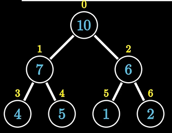
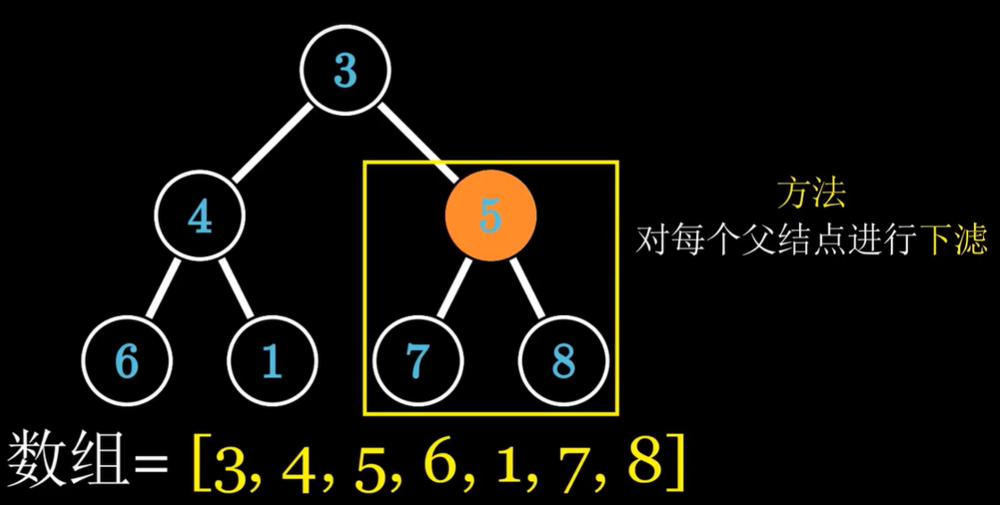

# 堆

堆主要就是涉及堆排序和优先队列。

## 基础

- 堆必须是一个完全二叉树
- 大根堆中每个父节点元素都要大于子节点元素，小根堆相反。
- 堆虽然是完全二叉树，但不是用二叉树存储的，而是用数组，若某个节点下标为i，则左子结点下标为2i+1，右子节点下标为2i+2



#### 堆的基本操作

##### 上滤

根节点向下调整，不断和子节点比较，如果不满足堆序性，就交换根节点和子节点，直到满足堆或者到达底部,复杂度logN

##### 下滤

树的最后一个元素向上调整，复杂度logN

#### 建堆

##### 自顶向下建堆

将数组元素添加到堆的最后一个元素，并进行上滤

##### 自下而上建堆

先把元素放进堆中，然后从最后一颗子树开始，对每个父节点进行下滤，直到满足堆序性或到达底部



要快一点，复杂度为on

## 堆排序

堆排序流程是，先初始化堆，然后取出根节点元素，然后建堆，直到取出所有元素

```java
public void heapSort(int[] nums){
    int heapSize = nums.length;
    buildMaxHeap(nums, heapSize);
    for(int i = nums.length - 1; i >= 0; i--){
        swap(nums, 0, i); //一般都是把根元素和最后一个元素交换，最后就能得到一个排序好的序列
        --heapSize;
        maxHeapify(nums, 0, heapSize); // 每次取走根后，就对交换上来的根进行下滤
    }
}

public void buildMaxHeap(int[] a, int heapSize){
    for(int i = heapSize/2; i>=0; i--){ //这一步就是自底向上建堆
        maxHeapify(a, i, heapSize);
    }
}

public void maxHeapify(int[] a, int i, int heapSize){ // 下滤
    int l = i * 2 + 1, r = i * 2 + 2, largest = i;
    if(l < heapSize && a[l] > a[largest]) largest = l;
    if(r < heapSize && a[r] > a[largest]) largest = r;
    if(largest != i){
        swap(a, i, largest);
        maxHeapify(a, largest, heapSize);
    }
}
```

## 优先队列

优先队列基于堆实现，插入操作即自顶向下建堆，上滤，弹出操作弹出根元素，然后把最后一个元素放到根进行下滤。

- 所以之前有一次用优先队列就用错了，将元素全部插入后直接遍历优先队列了，然后就发现根本没有顺序，正确的做法应该是一次弹出一个

#### [347. 前 K 个高频元素](https://leetcode.cn/problems/top-k-frequent-elements/)

给你一个整数数组 `nums` 和一个整数 `k` ，请你返回其中出现频率前 `k` 高的元素。你可以按 **任意顺序** 返回答案。

**示例 1:**

```
输入: nums = [1,1,1,2,2,3], k = 2
输出: [1,2]
```

**示例 2:**

```
输入: nums = [1], k = 1
输出: [1]
```

**提示：**

- `1 <= nums.length <= 105`
- `k` 的取值范围是 `[1, 数组中不相同的元素的个数]`
- 题目数据保证答案唯一，换句话说，数组中前 `k` 个高频元素的集合是唯一的

##### 代码

```java
public int[] topKFrequent(int[] nums, int k) {
    // 先统计频率情况
    Map<Integer, Integer> frequencyForNum = new HashMap<>();
    for(int num: nums){
        frequencyForNum.put(num, frequencyForNum.getOrDefault(num, 0)+1);
    }
	// 优先队列默认情况下是小顶堆
    PriorityQueue<int[]> queue = new PriorityQueue<>(new Comparator<int[]>(){
        public int compare(int[] m, int[] n){
            return m[1] - n[1];
        }
    });
    // 将每个数和对应频率加入优先队列，当队列长度满k，比较要插入元素和堆顶元素，如果堆顶更大，就意味着堆里k个元素都比当前元素大，直接把当前元素扔掉就行了，否则把堆顶弹出，插入当前元素。
    for(Map.Entry<Integer, Integer> entry: frequencyForNum.entrySet()){
        int num = entry.getKey(), count = entry.getValue();
        if(queue.size() == k){
            if(queue.peek()[1] < count){
                queue.poll();
                queue.offer(new int[] {num, count});
            }
        }else{
            queue.offer(new int[]{num, count});
        }
    }
    int[] ret = new int[k];
    for(int i = 0;i < k;i++){
        ret[i] = queue.poll()[0];
    }
    return ret;
}
```

#### [295. 数据流的中位数](https://leetcode.cn/problems/find-median-from-data-stream/)

**中位数**是有序整数列表中的中间值。如果列表的大小是偶数，则没有中间值，中位数是两个中间值的平均值。

- 例如 `arr = [2,3,4]` 的中位数是 `3` 。
- 例如 `arr = [2,3]` 的中位数是 `(2 + 3) / 2 = 2.5` 。

实现 MedianFinder 类:

- `MedianFinder() `初始化 `MedianFinder` 对象。
- `void addNum(int num)` 将数据流中的整数 `num` 添加到数据结构中。
- `double findMedian()` 返回到目前为止所有元素的中位数。与实际答案相差 `10-5` 以内的答案将被接受。

**示例 1：**

```
输入
["MedianFinder", "addNum", "addNum", "findMedian", "addNum", "findMedian"]
[[], [1], [2], [], [3], []]
输出
[null, null, null, 1.5, null, 2.0]

解释
MedianFinder medianFinder = new MedianFinder();
medianFinder.addNum(1);    // arr = [1]
medianFinder.addNum(2);    // arr = [1, 2]
medianFinder.findMedian(); // 返回 1.5 ((1 + 2) / 2)
medianFinder.addNum(3);    // arr[1, 2, 3]
medianFinder.findMedian(); // return 2.0
```

**提示:**

- `-105 <= num <= 105`
- 在调用 `findMedian` 之前，数据结构中至少有一个元素
- 最多 `5 * 104` 次调用 `addNum` 和 `findMedian`

##### 分析

- 维护两个优先队列，分别是小于中位数的队列和大于中位数的队列，要时刻维护小队列比大队列多1或者相等
- 当插入新的元素时，如果新元素小于queMin的根元素，也就是新元素比中位数小，插入queMin，如果比queMax的根大，也就是大于中位数，插入queMax。
- 如果queMin比queMax多1，那么直接弹出queMin的根，如果相等就取两根平均。

##### 代码

```java
class MedianFinder {
    PriorityQueue<Integer> queMin; // 小于中位数的队列用大顶堆
    PriorityQueue<Integer> queMax; // 大于中位数的队列用小顶堆

    public MedianFinder() {
        queMin = new PriorityQueue<Integer>((a, b) -> (b - a));
        queMax = new PriorityQueue<Integer>((a, b) -> (a - b));
    }
    
    public void addNum(int num) {
        if(queMin.isEmpty() || num <= queMin.peek()){
            queMin.offer(num);
            if(queMax.size() + 1 < queMin.size()){
                queMax.offer(queMin.poll());
            }
        }else{
            queMax.offer(num);
            if(queMax.size() > queMin.size()){
                queMin.offer(queMax.poll());
            }
        }
    }
    
    public double findMedian() {
        if(queMin.size() > queMax.size()){
            return queMin.peek();
        }
        return (queMin.peek() + queMax.peek()) / 2.0;
    }
}
```

